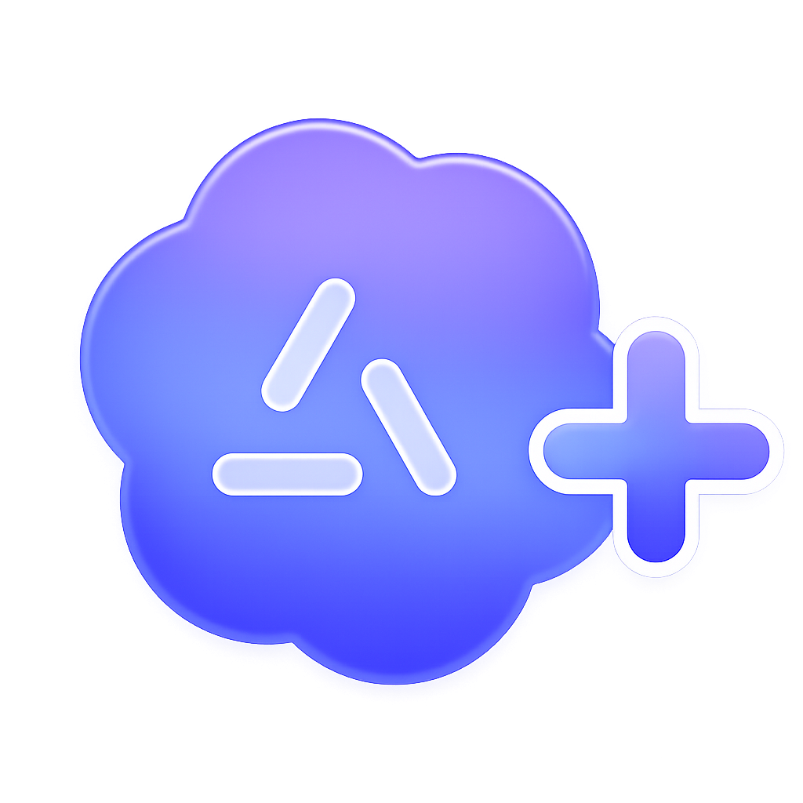

# codex-agents-md-plus 

[](https://github.com/kevinhwang/codex-agents-md-plus/actions/workflows/ci.yml)



A [Codex CLI plugin](https://github.com/openai/codex) that improves AGENTS.md handling: adds support for additive `AGENTS.local.md` overlays and recursive `@`-reference expansion, with end-to-end support for linked git worktrees.

```shell
codex plugin marketplace add github.com/kevinhwang/codex-agents-md-plus
codex plugin add codex-agents-md-plus@codex-agents-md-plus
```

## Motivation

Codex's native AGENTS.md handling has two gaps relative to peer agent products like Claude Code:

1. **No additive local overlay.** Codex recognizes `AGENTS.override.md` as a full *replacement* for `AGENTS.md`, but has no equivalent of Claude Code's `CLAUDE.local.md` — a per-machine or per-workspace file that *adds* to project instructions without shadowing the checked-in `AGENTS.md`. This is what most users want for personal preferences, machine-specific paths, or temporary notes.
2. **No `@`-reference expansion.** Claude Code expands `@docs/file.md` style imports recursively when it walks `CLAUDE.md`. Codex parses AGENTS files as plain text — `@` references are inert.

A feature request for these ([openai/codex#28739](https://github.com/openai/codex/issues/28739)) has been opened but remains unclaimed. This plugin closes both gaps as a Codex `SessionStart` / `SubagentStart` hook.

It also handles a worktree case Claude Code does not: an `AGENTS.local.md` that lives in the main repo is visible from inside any linked git worktree, including siblings that aren't filesystem-nested under the main repo.

## Comparison

### Feature support

| Feature                                                                          | Claude Code                        | Codex (native)                                                       | Codex + this plugin                                    |
|----------------------------------------------------------------------------------|------------------------------------|----------------------------------------------------------------------|--------------------------------------------------------|
| **Additive local overlay** (`CLAUDE.local.md` / `AGENTS.local.md`)               | ✅                                  | ❌                                                                    | ✅                                                      |
| **`@`-reference expansion**                                                      | ✅                                  | ❌                                                                    | ✅                                                      |
| **Linked worktree (nested) pulls main-repo overlay**                             | ✅                                  | ❌                                                                    | ✅                                                      |
| **Linked worktree (sibling) pulls main-repo overlay**                            | ❌                                  | ❌                                                                    | ✅                                                      |
| **Per-file source-path labeling in the prompt**                                  | ✅                                  | ❌ (files concatenated with a single `--- project-doc ---` separator) | ✅                                                      |
| **Sealed content boundaries** (untrusted file body can't break out of its block) | partial (predictable wrapper tags) | partial (predictable `<INSTRUCTIONS>` tags)                          | ✅ (per-file tags can't be forged from inside the file) |
| **Dedupe across resumes**                                                        | N/A (transcript replaced)          | N/A                                                                  | ✅                                                      |

Codex has no in-session cwd-mutation concept (no `/cd`, no `EnterWorktree` tool) — the working directory is fixed at session launch. Claude Code's working-directory anchor can drift mid-session; Codex's cannot. So "re-walk on mid-session cwd change" doesn't really apply to Codex. The plugin re-runs naturally on Codex's lifecycle events (`SessionStart` for resume/clear/compact, `SubagentStart` for every subagent dispatch).

### Behavior

| Aspect                      | Claude Code                                                            | Codex (native)                                                  | Codex + this plugin                                                       |
|-----------------------------|------------------------------------------------------------------------|-----------------------------------------------------------------|---------------------------------------------------------------------------|
| **Project file**            | `CLAUDE.md`                                                            | `AGENTS.md`                                                     | unchanged                                                                 |
| **Project override**        | N/A                                                                    | `AGENTS.override.md` (replaces `AGENTS.md`)                     | unchanged                                                                 |
| **User-tier file**          | `~/.claude/CLAUDE.md`                                                  | `~/.codex/AGENTS.md`                                            | delegated to Codex; provenance mapped                                     |
| **Subdir variants**         | `<dir>/.claude/CLAUDE.md`, `<dir>/.claude/rules`                       | N/A                                                             | N/A                                                                       |
| **Walk anchor**             | mutable per-agent working directory (resets on `/cd`, `EnterWorktree`) | session-start cwd                                               | per-event: session uses rollout-transcript cwd; subagent uses its own cwd |
| **Walk shape**              | cwd-ancestor chain up to FS root                                       | project-root (default: nearest `.git`) → cwd                    | project-root → cwd, plus worktree-pivoted parallel walk                   |
| **File precedence per dir** | all overlapping files loaded                                           | first match of override / default / configured fallbacks        | per-file fallback: worktree's own file → main repo's same file            |
| **Prompt placement**        | system prompt                                                          | conversation transcript, user-role, wrapped in `<INSTRUCTIONS>` | conversation transcript, developer-role (additive to Codex's own)         |

## How it works

This plugin is a [Codex hook](https://github.com/openai/codex). It registers two events: `SessionStart` (matching `startup|resume|clear|compact`) and `SubagentStart` (matching all subagent types). On each event, it reads the hook payload, builds an overlay block, and emits it as `additionalContext`. Codex inserts the block as a developer-role message in the conversation transcript.

The plugin never modifies, replaces, or duplicates Codex's native AGENTS.md handling — Codex's own user-role `<INSTRUCTIONS>` block still appears as it always does. The plugin's output is a *sidecar* that surfaces what Codex's native walk would miss and adds a compact provenance map for the native block.

### Walk strategy

For each directory in the project-root → active-cwd chain, two filename families are resolved independently:

1. **Project-typed**: `AGENTS.override.md` then `AGENTS.md` then user-configured fallback names (first match wins). The plugin reads these for `@`-references but does **not** re-emit their bodies, since Codex already injects them natively.
2. **Local overlay**: `AGENTS.local.md`. Always re-emitted (Codex doesn't load it).

When the active cwd is inside a linked git worktree, each directory's *parallel* path in the main worktree is also considered with per-file precedence: the worktree's own file wins if present; otherwise the main repo's file at the corresponding directory is used. The main worktree's ancestors (up to FS root) are scanned the same way.

### Walk anchor

Two events drive the plugin, each picking its anchor differently:

- **`SessionStart`** (startup, resume, clear, compact) — anchored to the Codex rollout transcript's `session_meta.cwd` record (the directory Codex was launched from). Stable across resumes and compacts, even if the active cwd has drifted. Falls back to the hook payload's `cwd` when the transcript is unavailable.
- **`SubagentStart`** — anchored to the subagent's own dispatched `cwd` from the hook payload. A subagent operating in a different directory than its parent gets its own walk.

In both cases, the project-root marker (`.git` by default) is the same one Codex's native discovery uses.

### Linked-worktree pivot

When the active cwd is inside a linked git worktree, the plugin resolves the path of the corresponding *main* worktree and includes its directories in the walk. The resolution validates the worktree's `.git` linkage end-to-end, so a hostile `.git` file cannot redirect the walk to an arbitrary directory.

### `@`-reference expansion

References use `@path/to/file.ext` syntax, resolved relative to the file containing the reference. A token is recognized only when it stands on its own at a word boundary, isn't inside a code fence or backtick span or HTML comment, and points at a common text/document extension.

Expansion is breadth-first. References are deduplicated by canonical path, cycles are broken on second visit, and four budget guards bound the work: max depth (default 5), max files (default 32), max bytes per file (default 32 KiB), and max total reference bytes (default 128 KiB). Files outside the session/cwd guards are skipped and listed under "Skipped references" in the output.

### Rendered output

The plugin emits a single block wrapped in `<agents_md_extra_context>…</agents_md_extra_context>` as `additionalContext`. Codex inserts it into the conversation transcript as a developer-role message. Inside, each file body emitted by the plugin is wrapped in its own per-file `<file:… path="…">` tag. Subsections:

- **Codex native AGENTS disambiguation** — metadata-only map for filesystem-backed AGENTS files Codex already rendered natively.
- **Local AGENTS overlays** — `AGENTS.local.md` bodies.
- **Inherited AGENTS instructions** — project-typed files from main-repo paths Codex's native walk would not have reached.
- **Referenced document index** — `@`-expanded documents.
- **Skipped references** — references that hit a guard, with the reason.

Two properties fall out of the per-file wrapping:

- **Attribution.** Every directive is clearly tied to its source path. Codex's native render concatenates bodies with a single `--- project-doc ---` separator and no per-file labels, so the model can't easily attribute a statement to the file it came from.
- **Sealed boundaries.** Each file's closing tag is bound to its content. A hostile file body can't forge that closing tag from the inside, so untrusted file content stays cleanly contained within its wrapper.

The preamble explicitly frames the contents as user/project-tier guidance, equivalent in authority to AGENTS.md — even though the transport role is `developer`.

For Codex-native AGENTS files, the plugin emits paths and short first-line anchors but not bodies. This avoids duplicating Codex's own `<INSTRUCTIONS>` content while giving the model enough structure to disambiguate flattened segments and resolve relative filesystem references against each source file's containing directory. Current Codex inserts `--- project-doc ---` on the transition from Codex-home/global instructions to project instructions; adjacent project instruction files are otherwise joined by blank lines.

### Lifecycle refresh

Codex fires `SessionStart` on initial startup, on resume, after `/clear`, and after `/compact`. The plugin re-runs on each. `SubagentStart` fires for every subagent dispatch — when the subagent inherits a different cwd from its parent, the subagent gets its own walk.

### Resume dedupe

Every emitted block opens with a `<!-- codex-agents-md-plus sha256:... -->` marker. On `SessionStart` with `source: "resume"`, the plugin scans the transcript tail for the same marker. Match → suppress (existing block is still current). Mismatch (e.g., an overlay or `@`-referenced file was edited) → emit a fresh block; the preamble notes that any earlier block with a different hash is superseded.

## Configuration

All env vars are optional. Defaults shown.

| Variable                                         | Default  | Effect                                                                                                                     |
|--------------------------------------------------|----------|----------------------------------------------------------------------------------------------------------------------------|
| `CODEX_AGENTS_MD_PLUS_MAX_DEPTH`                 | `5`      | Max `@`-expansion depth.                                                                                                   |
| `CODEX_AGENTS_MD_PLUS_MAX_FILES`                 | `32`     | Max referenced files per session.                                                                                          |
| `CODEX_AGENTS_MD_PLUS_MAX_FILE_BYTES`            | `32768`  | Max bytes read per instruction or referenced file.                                                                         |
| `CODEX_AGENTS_MD_PLUS_MAX_TOTAL_REFERENCE_BYTES` | `131072` | Max total bytes across all referenced files.                                                                               |
| `CODEX_AGENTS_MD_PLUS_ALLOW_OUTSIDE_ROOT`        | `false`  | Allow `@`-references to resolve outside session/cwd guards.                                                                |
| `CODEX_AGENTS_MD_PLUS_FALLBACK_FILENAMES`        | `""`     | Comma-separated additional project-doc filenames (e.g., `INSTRUCTIONS.md,CONTRIBUTING.md`). `AGENTS.local.md` is reserved. |

## Install from a local clone

```shell
git clone https://github.com/kevinhwang/codex-agents-md-plus
cd codex-agents-md-plus
just install
```

`just install` runs:

```shell
codex plugin marketplace add "$(pwd)"
codex plugin add codex-agents-md-plus@codex-agents-md-plus
```

The first time Codex runs the hook, it prompts to trust the hook command (one-time per hook identity).

To uninstall:

```shell
just uninstall
```

---

Contributing or working on the plugin code? See [DEVELOPMENT.md](DEVELOPMENT.md).
